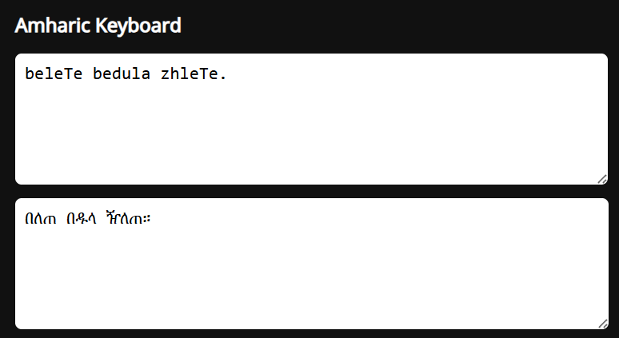

# Amharic Typing & Transcription App

An easy-to-use application for typing **Amharic (አማርኛ)** using Latin characters, with a built-in **transcription (transliteration) table** that maps Latin input to Ethiopic (Geʽez) script.

Perfect for learners, writers, developers, and anyone who wants to type Amharic without a native keyboard.

## Features

* Type Amharic using Latin letters
* Real-time transliteration to Ethiopic script
* Built-in Amharic transcription table
* Simple and intuitive input rules
* Works on modern browsers/devices 📱💻 

---
## Usage

1. Open the URL
2. Start typing Amharic using Latin letters on the first text area
3. The Ethiopic script appears automatically in the second text area
4. Use the [transcription table](./alphabet-table.html) for reference

<p align="center">
  
</p>


## 🚀 Live Demo
[](https://sisayie.github.io/amharic-typing/)

---

## 🧩 How It Works

You type Amharic words using Latin characters, and the app automatically converts them into Ethiopic characters based on standard transliteration rules.

**Example:**

```
selam  →  ሰላም
amhargna → አማርኛ
BeleTe bedula zheleTe. →  በለጠ በዱላ ዠለጠ።
```

---

## 🧾 Transcription Table (Sample)

| Latin Input | Amharic |
| ----------- | ------- |
| he          | ሀ       |
| hu          | ሁ       |
| hi          | ሂ       |
| ha         | ሃ       |
| hee          | ሄ       |
| h           | ህ       |
| ho          | ሆ       |
| le          | ለ       |
| He          | ሐ       |
| me          | መ       |

> 📌 * The [full transcription table is available here](./alphabet-table.html)*

---

## 📚 Use Cases
This app can be used for various use cases such as:
* Learning Amharic typing
* Writing Amharic text without an Ethiopic keyboard
* Educational tools
* Language processing projects

---

## Contributing

Contributions are welcome!

1. Fork the repository
2. Create a new branch (`feature/your-feature`)
3. Commit your changes
4. Open a Pull Request


## 📄 License

This project is licensed under the **MIT License**.
Feel free to use, modify, and distribute.
